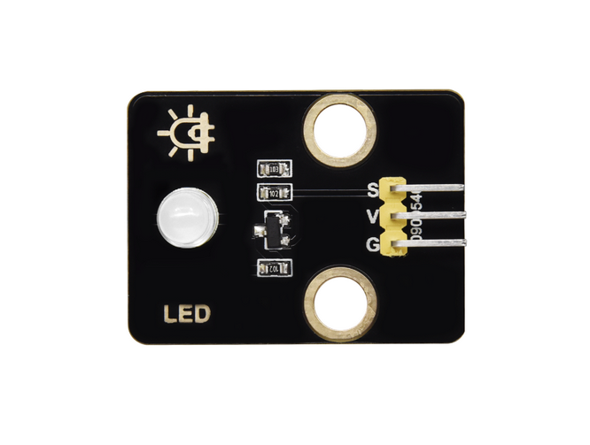
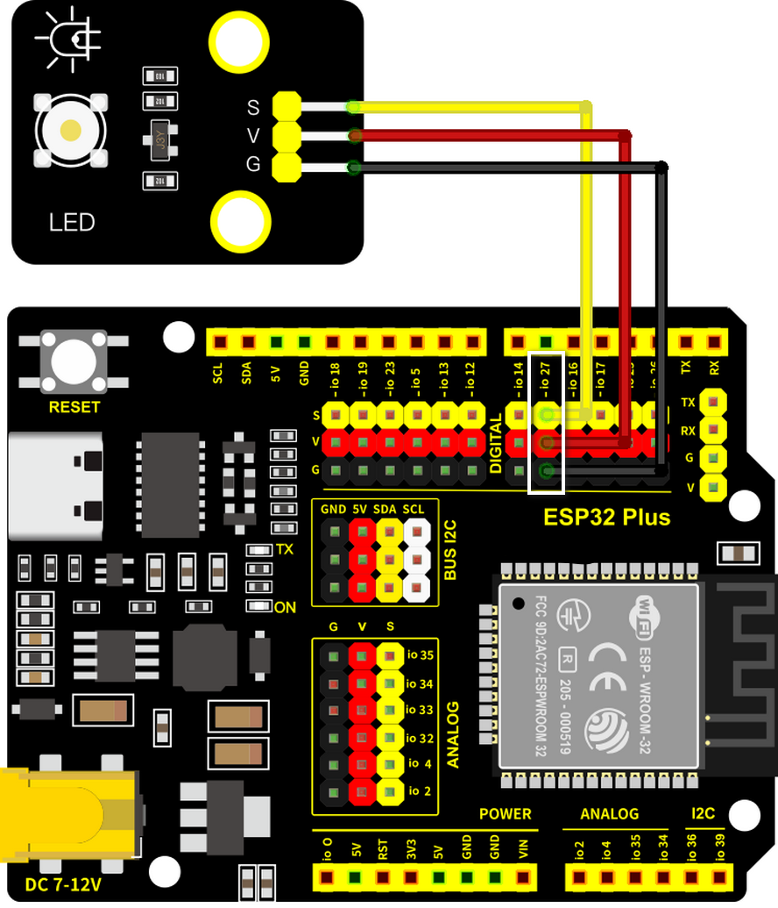
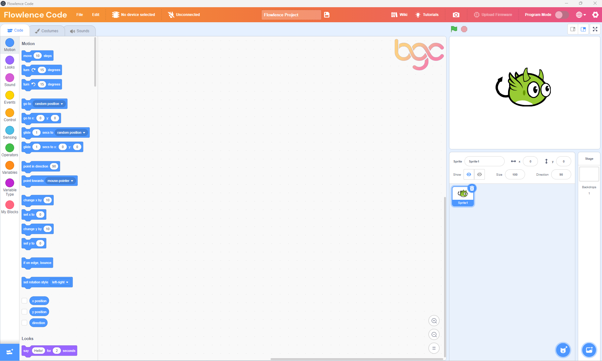
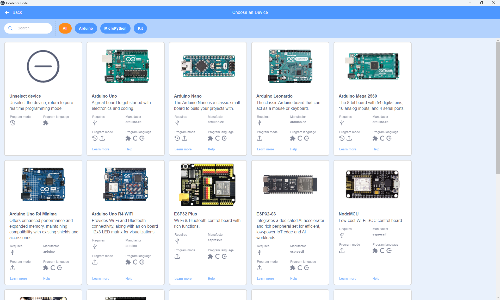
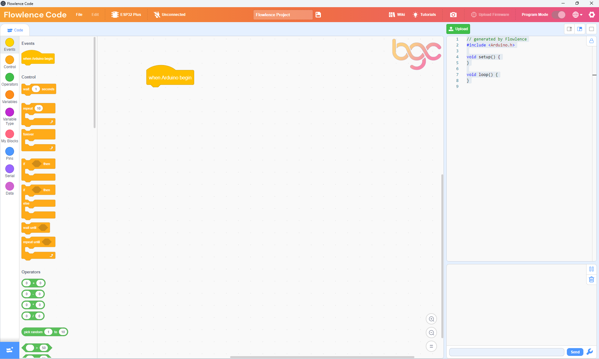
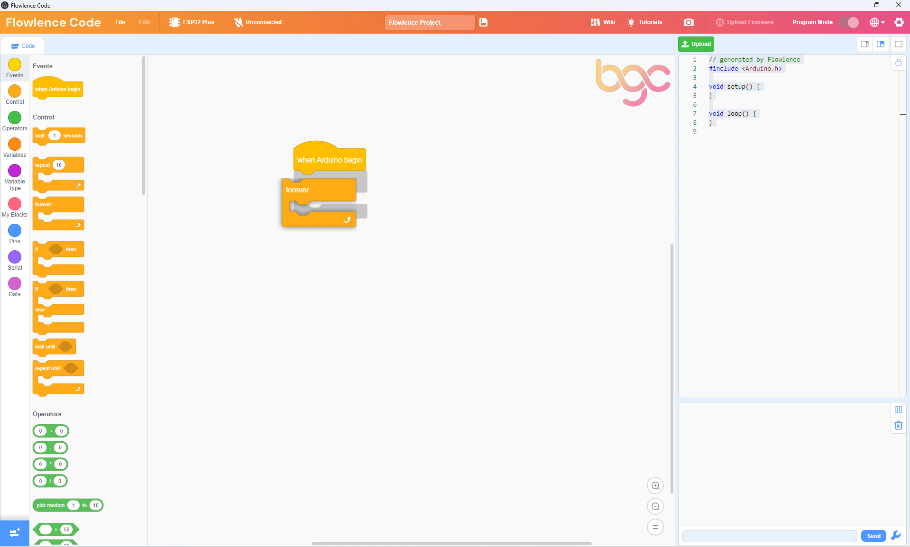
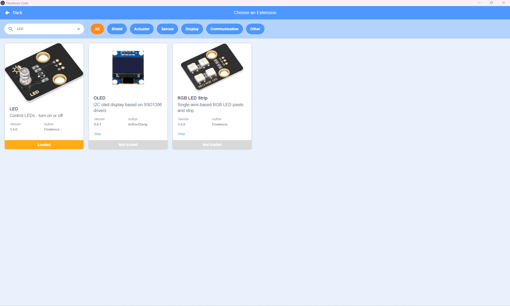
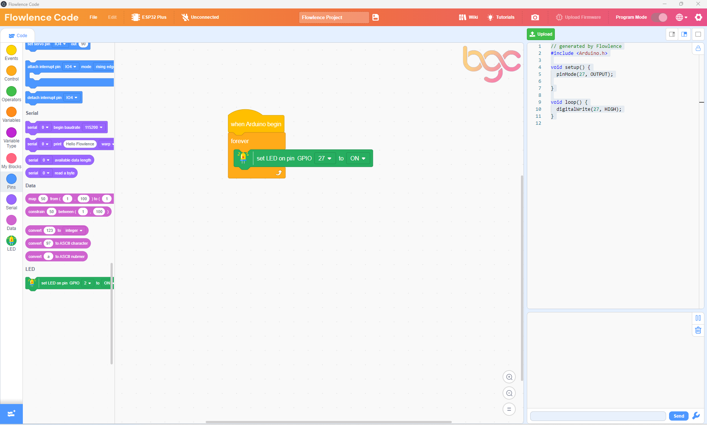
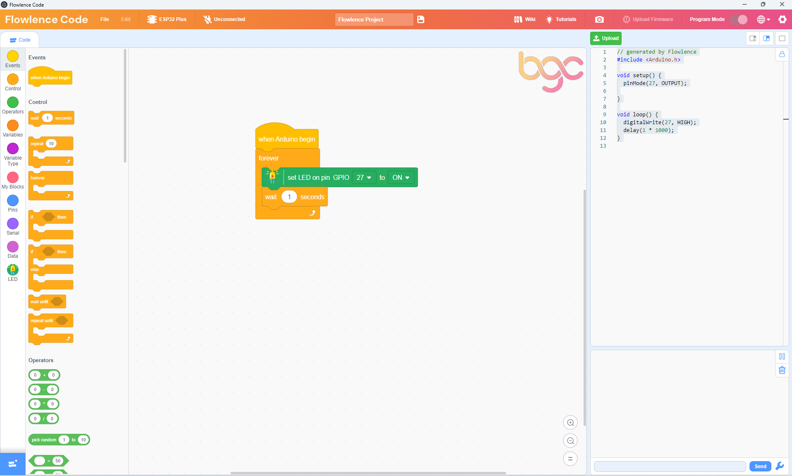
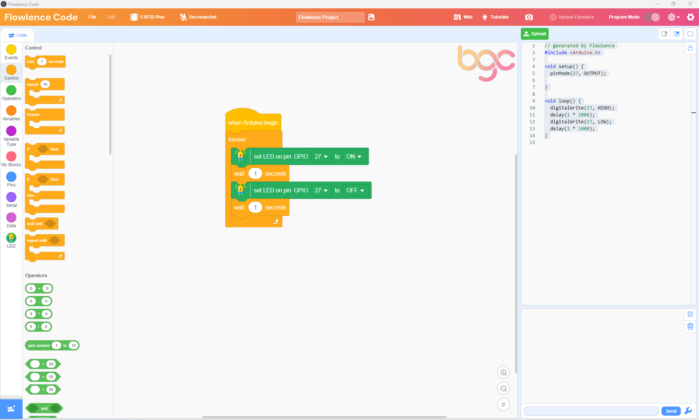

# Your First Program

In this lesson, you'll wire up the **White LED module** from your kit and write a program that makes it blink — one second on, one second off, repeating forever. By the end of the next 20 minutes, you'll have flashed your first program onto the ESP32 and watched real hardware respond to your code.

## What you'll learn

- How to choose your board (ESP32 Plus) inside Flowlence Code
- How to add a sensor extension (the **LED** category)
- How to chain blocks: `when Arduino begin` → `forever` → output blocks → `wait`
- How to upload a program over USB and see it run

## What you need

From your Flowlence IoT Kit:

- **ESP32 Plus** board (×1)
- **White LED module** (×1) — small board with G/V/S header, the LED already mounted
- **3-pin Dupont cable** (×1)
- **USB-C cable** (×1)

That's it. No breadboard, no resistor — the LED module has the resistor built in.

{ width="320" }

## Wire it up

!!! warning "Unplug USB before wiring"
    Always disconnect the USB cable before plugging or unplugging modules. Moving wires while the board is powered can short pins.

| LED Module pin | ESP32 Plus pin | Wire |
|----------------|----------------|------|
| **S** (Signal) | **IO 27** | 🟡 Yellow |
| **V** (Voltage) | V on the same header | 🔴 Red |
| **G** (Ground) | G on the same header | ⚫ Black |

A single 3-pin Dupont cable carries all three connections at once. Plug one end into the LED module (match S/V/G), the other end into the **IO 27** header on the ESP32 Plus. The connector is keyed — if it doesn't slide on easily, you've got it backwards.



Once wired, plug the USB cable back in.

## Write the program — step by step

Each screenshot below shows the expected state of Flowlence Code after that step. If your screen doesn't match, scroll back and redo the previous step.

### Step 1 · Open Flowlence Code

When Flowlence Code first opens, the workspace shows a Scratch-style cat sprite and the block categories on the far-left say *Motion / Looks / Sound*. These are for animation — we need IoT blocks instead.



Click **No device selected** in the orange top bar.

### Step 2 · Choose your device — ESP32 Plus

A device picker appears with all the supported boards. Find **ESP32 Plus** (it's tagged as a kit board) and click it.



After you pick ESP32 Plus, the block categories on the left change completely — *Motion / Looks / Sound* disappear and you see *Events / Control / Operators / Variables / Variable Type / My Blocks / Pins / Serial / Data*. These are the IoT blocks.

### Step 3 · Drop a `when Arduino begin` block

From the **Events** category (yellow), drag the `when Arduino begin` block into the workspace. This is where every program starts.



Notice the right-hand panel now shows the generated Arduino C++ code — empty `setup()` and `loop()` functions. As you add blocks, code appears here automatically.

### Step 4 · Add a `forever` loop and snap it on

From the **Control** category (orange), drag a `forever` block underneath `when Arduino begin`. They snap together when you bring them close enough.



Anything inside `forever` will repeat over and over until the ESP32 is turned off.

### Step 5 · Add the LED extension

The LED block isn't loaded by default — you have to add it from the extension library. Click the blue **Add Extension** button in the bottom-left corner of the screen, then in the search box type "LED".



Click the **LED** card. It says **Loaded** when ready. Click **Back** to return to the workspace — a new green **LED** category now appears at the bottom of the block list.

### Step 6 · Drop the first LED block

Open the **LED** category (green). Drag the `set LED on pin GPIO 27 to ON` block inside the `forever` loop.



The block already defaults to `GPIO 27` and `ON` — exactly what we need.

!!! info "GPIO 27 vs IO 27"
    The block dropdown writes the pin as **GPIO 27** (its formal name). The header on your ESP32 Plus board is silkscreened **IO 27**. They're the same pin — just two different names.

### Step 7 · Add a wait

Back to the **Control** category — drag a `wait 1 seconds` block underneath the LED block, still inside the `forever` loop.



This holds the LED on for one second before the next block runs.

### Step 8 · Add the OFF block and a second wait, then upload

Add another `set LED on pin GPIO 27` block, click its dropdown, and change `ON` to **OFF**. Then drag in another `wait 1 seconds`. Your final program looks like this:



## Upload and watch

1. Make sure the USB cable is plugged in.
2. Click **Connect** in the top bar, pick the COM port that appears, then click the green **Upload** button (top right).
3. Wait about 30 seconds for the program to compile and flash.

The LED on your wired-up module starts blinking — **on for 1 second, off for 1 second, repeat.**

!!! tip "No COM port appears?"
    You may need to install the USB driver. See [Troubleshooting → Can't connect to the ESP32](../reference/troubleshooting.md#cant-connect-to-the-esp32).

!!! success "Congratulations!"
    You just wrote, compiled, and flashed your first program onto a real microcontroller. Take a moment — that LED blinking on the desk in front of you is *your code* running on a chip you'll soon be using to water plants and detect fires.

## Understanding the code

Look at the **Code Panel** on the right side. It shows the Arduino C++ that Flowlence Code generated from your blocks:

```cpp
void setup() {
    pinMode(27, OUTPUT);
}

void loop() {
    digitalWrite(27, HIGH);
    delay(1000);
    digitalWrite(27, LOW);
    delay(1000);
}
```

This is the same program written in text-based code. Every block you add updates this view live — a great way to see how visual blocks map to professional code.

## Try it!

!!! question "Challenge 1 · Faster blink"
    Change both `wait 1 seconds` blocks to `wait 0.2 seconds`. Upload again. The LED now blinks five times faster — a nervous flashing, like a real warning indicator.

!!! question "Challenge 2 · Blink three times then pause"
    Use a `repeat 3` block from Control so the LED blinks three times quickly, then waits 2 seconds, then repeats. Real warning systems often use a pattern like this to grab attention.

!!! question "Challenge 3 · Looking ahead"
    In the [Smart Agriculture](../projects/agriculture/index.md) project, this same LED becomes a **low-water warning indicator** — instead of blinking forever, it lights up only when the plant's water tank runs low. You'll wire that logic up in [Build the Smart Agriculture System](../projects/agriculture/build.md).

## Next step

Now that you can wire a module, write a program, and upload it to your ESP32 — you're ready to build something that *responds* to the world. Your first project is **Smart Agriculture**: a self-watering plant system using the same LED you just blinked, plus a soil moisture probe, a water-level detector, and a pump.

[Start Smart Agriculture :material-arrow-right:](../projects/agriculture/index.md){ .md-button .md-button--primary }
