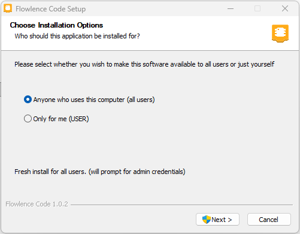
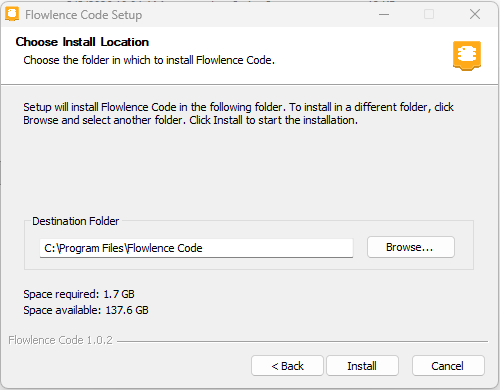
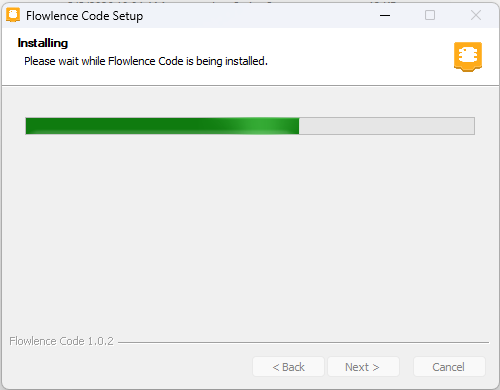
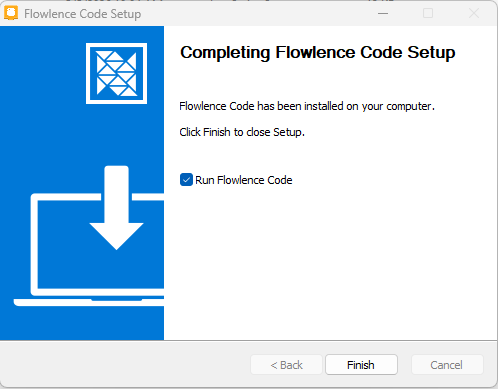
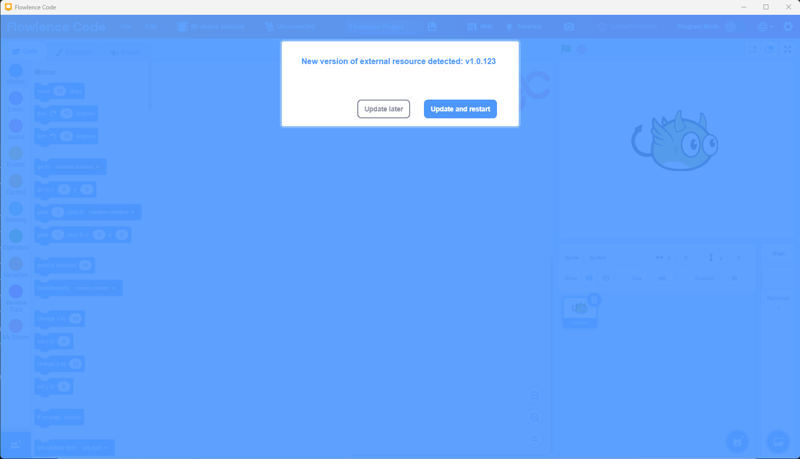
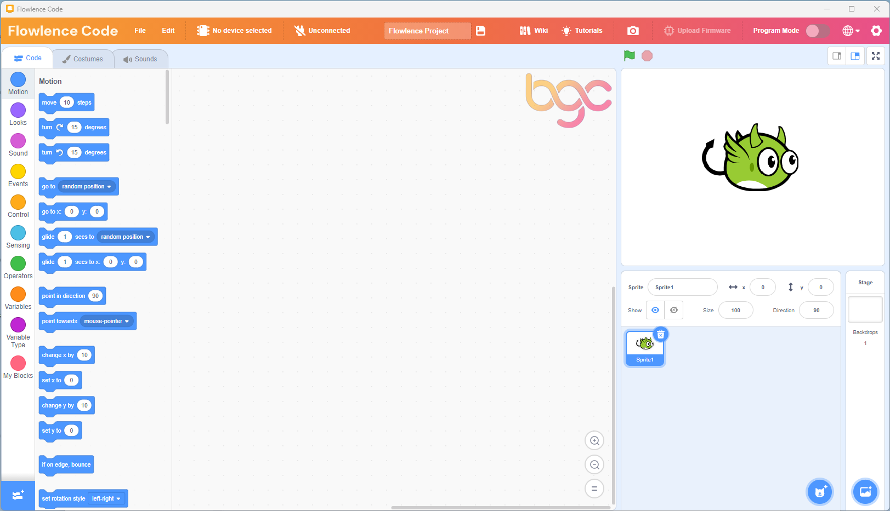

# Install Flowlence Code

## System requirements

- **Operating System:** Windows 10 or later
- **RAM:** 8 GB minimum (16 GB recommended)
- **Disk space:** 8 GB free
- **USB port:** one free port for the ESP32

## Download

!!! info "Download coming soon"
    The Flowlence Code installer is being finalized for general release. A direct download link will appear here as soon as it's ready.

    **Need it now?** Contact your RVP coordinator and they will share the installer with you directly.

!!! tip "On a different platform?"
    Flowlence Code is Windows-only at the moment. Mac and Linux builds are on the roadmap. If you're on a Mac or Linux machine, your STEM teacher can help you find a Windows machine for the workshop.

## Step 1 · Run the installer

Double-click the downloaded `.exe` to start the installer.

!!! info "See a Windows SmartScreen warning?"
    Windows may show *"Microsoft Defender SmartScreen prevented an unrecognised app from starting"*.

    Click **More info** → **Run anyway**. SmartScreen shows this notice for any specialized software that isn't shipped through the Microsoft Store. The installer is safe.

## Step 2 · Choose who can use it

Pick whether to install for **all users** (needs admin rights) or **just you** (no admin rights). For shared classroom computers, IT will usually choose *all users*; for your own laptop either is fine.

{ width="500" }

Click **Next**.

## Step 3 · Choose the installation location

The default (`C:\Program Files\Flowlence Code`) works for most people. Click **Install** to start.

{ width="500" }

!!! tip "1.7 GB needed"
    Flowlence Code bundles compilers, drivers, firmware, and sensor extensions, which is why the install is around 1.7 GB. You only need this much space once; the installer doesn't keep growing as you use the app.

## Step 4 · Wait for installation

The installer copies Flowlence Code, the block editor, the ESP32 toolchain (compilers), sensor extensions, and USB drivers. **This can take several minutes**, especially the first time, because the full kit is large.

{ width="500" }

## Step 5 · Finish and launch

When the installer completes, leave **Run Flowlence Code** ticked and click **Finish**.

{ width="500" }

## Step 6 · Update sensor extensions (one-time)

The first time Flowlence Code opens, it will check for the latest sensor blocks (LED, DHT11, soil moisture, etc.). If a newer version is available, you'll see a prompt like this:

{ width="700" }

Click **Update and restart**. The download takes 10–30 seconds depending on your internet speed.

!!! info "Why is there an update on day one?"
    Sensor blocks ship separately from the main app so we can add new sensors and fix block icons without you having to re-download the full installer. You'll see the same prompt occasionally as new sensors are added. Always click **Update and restart**.

## Step 7 · You're in

After the restart, Flowlence Code opens to the workspace.

!!! success "You're ready!"
    If you see this screen (Flowlence Code's wordmark in the top-left, blocks on the left, and the BGC watermark in the workspace), the installation worked.

    Next: [Tour the Interface](interface.md) to learn your way around, or jump straight to [Your First Program](first-program.md) to blink an LED.

---

## If something went wrong

- **Installer crashed or was blocked?** See [Troubleshooting → Flowlence Code won't install](../reference/troubleshooting.md#flowlence-code-wont-install).
- **Installed but won't open?** Try running Flowlence Code as administrator (right-click → *Run as administrator*) the first time.
- **Update prompt won't go away or hangs at 17%?** Click **Update later**, close Flowlence Code, then reopen it and try again.

## Next up

[Tour the Interface :material-arrow-right:](interface.md){ .md-button .md-button--primary }
