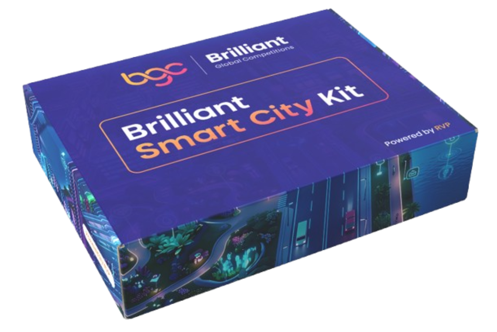
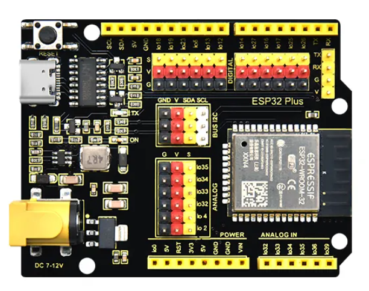
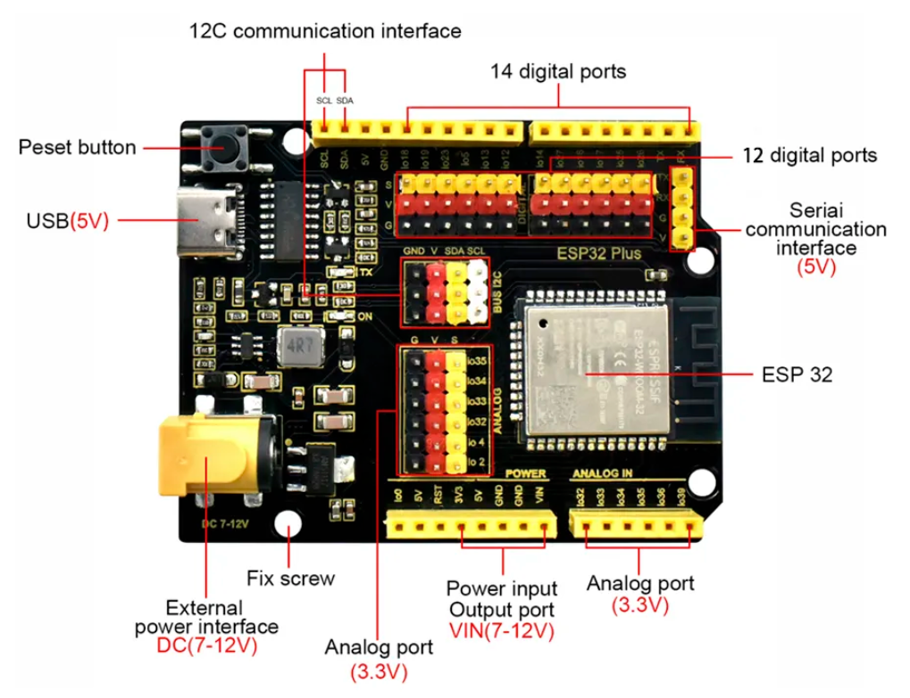

# Meet Your Kit

Your **Brilliant Smart City Kit** contains everything you need to build the four smart-city projects in this tutorial: no breadboard, no soldering, no extra parts to buy. Every sensor ships on a small breakout board with a Dupont cable that plugs straight into the **ESP32 Plus shield**. Most modules use a **3-pin** cable (Ground / Voltage / Signal); the I²C modules (LCD Display, RFID Reader) use a **4-pin** cable that adds the SCL clock line.

{ width="600" }

## The ESP32 Plus: your city's brain

Every project in this tutorial revolves around the **ESP32 Plus** board. It's a standard ESP32 microcontroller mounted on a shield that exposes every pin as a labelled **G / V / S** (Ground / Voltage / Signal) header, which means **you never need a breadboard**. You plug the Dupont cable from any sensor straight into the pin number the tutorial tells you to use.

{ width="320" }

Here's the same board with every region labelled. Refer back to this whenever a tutorial mentions a part of the board you're not sure about:

### What's on the board

| Region | What it's for |
|--------|--------------|
| **USB-C port (5 V)** | Power + upload cable from your computer |
| **External power jack (DC 7–12 V)** | Power from a battery or adapter when not plugged into a computer |
| **Reset button** | Restart the program without re-uploading |
| **14 digital ports** (top row) | Digital input/output pins with G/V/S headers |
| **12 digital ports** (middle row) | More digital pins, same layout |
| **I²C communication interface (SCL / SDA)** | For the LCD Display, RFID Reader, and other I²C devices |
| **Analog port (3.3 V)** | For analog sensors like the Soil Moisture Probe |
| **Analog IN** (io32, io34, io35, io39) | Input-only pins, good for sensors; can't be used as outputs |
| **Serial communication interface (5 V)** | Advanced: for talking to other devices over serial |
| **Power rails** (3V3, 5V, GND, VIN) | Handy access to power for projects that need extra hookups |

See the [Pin Map & Shield Layout](pin-map.md) for the exact pin each sensor uses.

!!! info "Why is the board called 'Plus'?"
    The plain ESP32 exposes its pins as two bare rows on the underside. The *Plus* variant adds the G/V/S headers, the DC power jack, and the full-size USB-C, so it's ready for beginners to use without a breadboard. The ESP32 chip itself is the same.

## Sensors and modules in your kit

These are the components you'll use across the four projects, grouped by smart-city pillar.

### 🌿 Sustainability: for Smart Agriculture

| Component | What it does |
|-----------|--------------|
| **Soil Moisture Probe** | Measures how wet or dry the soil is |
| **Water Level Detector** | Measures depth of water in the tank |
| **Water Pump** | Submersible pump that moves water from the tank |
| **Relay Module** | Switches the high-power pump on/off under ESP32 control |
| **Water Pipe + Plastic Box** | The tubing and reservoir for the water |
| **White LED module** | Status indicator, used as the "low water" warning |

### 🚦 Mobility: for Smart Parking

| Component | What it does |
|-----------|--------------|
| **Distance Sensor (Ultrasonic)** | Measures how close an object is, using sound waves |
| **Servo Motor** | Rotates to a precise angle, used as the gate |
| **RFID Reader** | Reads the unique ID stored in cards and key-fobs |
| **RFID Cards + Fob** | The "tags" people scan to authenticate |

### 🚨 Protection: for Smart Safety

| Component | What it does |
|-----------|--------------|
| **Fire Detector** | Senses the infrared light produced by an open flame |
| **Gas Leak Sensor** | Detects combustible gases like LPG and propane |
| **Active Buzzer** | Makes the loud alarm sound when triggered |

### 🌡️ Comfort: for Smart Temperature

| Component | What it does |
|-----------|--------------|
| **Temperature & Humidity Sensor (DHT11)** | Measures air temperature and humidity |
| **DC Motor** | Spins continuously, used as the cooling fan |
| **LCD Display** | Shows live temperature and humidity readings |

### 🔧 Supporting parts

| Item | Use |
|------|-----|
| **Dupont cables (3-pin and 4-pin)** | Connect each sensor module to the ESP32 Plus: 3-pin for most modules, 4-pin for the I²C ones (LCD, RFID Reader) |
| **USB-C cable** | Power and program the ESP32 from your computer |

## Taking care of your kit

!!! warning "Before you plug anything in"
    - **Always disconnect the USB cable** before connecting or moving a sensor cable.
    - The Dupont cables are female-to-female: align the colors with the **G / V / S** labels on each side, then push gently until the connector is fully seated.
    - Components are reusable. Handle them gently and return them to the kit between sessions.

!!! danger "Sensors that need extra care"
    - **Water Pump**: must be fully submerged before running, or it will burn out.
    - **Gas Leak Sensor**: gets warm during use (there's a tiny heater inside), this is normal.
    - **Fire Detector**: for testing use a small candle or long lighter with adult supervision; never test near flammable materials.

## Next up

[Install Flowlence Code :material-arrow-right:](install.md){ .md-button .md-button--primary }
