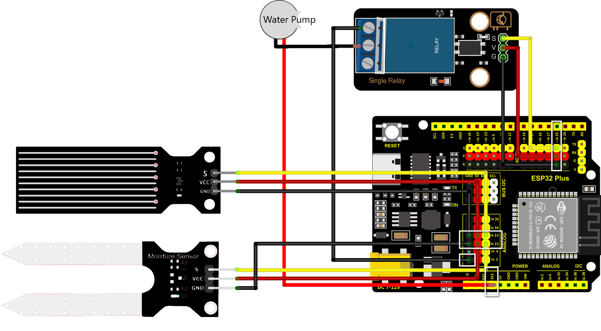
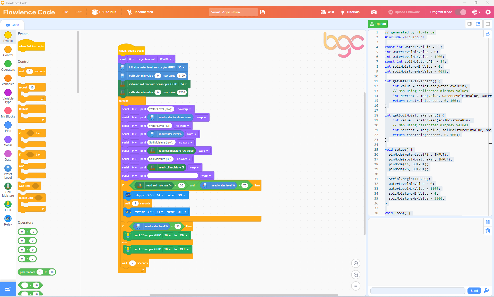

# Build the Smart Agriculture System

!!! abstract "At a glance"
    **What you'll build:** the full self-watering plant system. The soil-moisture probe watches the dirt, the water-level detector watches the tank, and the relay-controlled pump waters the plant *only* when both conditions are right. An LED warns when the tank runs low.

    **Smart-city pillar:** 🌿 Sustainability: Smart Irrigation & Water Management

    **Prerequisites:** [White LED](led.md), [Soil Moisture Probe](soil-moisture.md), [Water Level Detector](water-level.md), [Water Pump (with Relay)](water-pump.md).

    **Time:** about 60 minutes.

---

## Overview

Real smart-irrigation systems combine *sensor* readings with *safety* logic to decide when to water. Watering on a fixed schedule wastes water; instead, the system reads the actual conditions and acts accordingly. Your build does the same, with two safety rules:

- **Don't water if the soil is already wet**: that's wasteful and can drown the plant.
- **Don't run the pump if the tank is empty**: the pump is water-cooled and will burn out within a minute if it runs dry.

So the decision logic uses two sensors at once before running the pump. The LED warns when the tank needs refilling.

## Components needed

All from your Brilliant Smart City Kit.

| Component | Quantity |
|-----------|----------|
| ESP32 Plus board | 1 |
| White LED module | 1 |
| Soil Moisture Probe | 1 |
| Water Level Detector | 1 |
| Relay Module | 1 |
| Water Pump | 1 |
| Water Pipe | 1 |
| Plastic Box (water tank) | 1 |
| 3-pin Dupont cables | 4 |
| USB-C cable | 1 |

## Wiring

The full system has four sensor/actuator modules connected to the ESP32 Plus, plus the pump itself running through the relay's terminal block.



| Module | ESP32 Plus pin |
|--------|----------------|
| White LED (low-water warning) | **GPIO 27** |
| Soil Moisture Probe | **IO 32** (Analog IN) |
| Water Level Detector | **IO 33** (Analog IN) |
| Relay Module (controls pump) | **IO 19** |
| Water Pump | Wired through the Relay's terminal block (not directly to the ESP32) |

!!! warning "Disconnect USB before wiring"
    Always unplug, wire, plug back in. Moving wires while powered can short pins and damage the board.

!!! danger "Submerge the pump before powering on"
    The pump is water-cooled; running it dry damages it within a minute. **Fill the tank first**, drop the pump in, then plug in the USB cable.

## How it works

The full decision loop runs every couple of seconds:

```
┌───────────────────────────────┐
│ Read soil moisture (IO 32)    │
│ Read water level (IO 33)      │
└────────────┬──────────────────┘
             │
       ┌─────▼──────────┐
       │ Tank empty?    │── Yes ──→ LED ON (low water warning)
       │ (level < 500)  │           Pump OFF (safety)
       └─────┬──────────┘
             │ No (tank has water)
             ▼
       LED OFF
       │
       ┌─────▼──────────┐
       │ Soil dry?      │── No ──→ Pump OFF, wait 5 sec, loop
       │ (moisture>3000)│
       └─────┬──────────┘
             │ Yes
             ▼
       Pump ON for 3 seconds
       Pump OFF
       Wait 5 sec, loop
```

In IF/THEN logic:

- **IF** water level is low → **THEN** LED ON, Pump OFF
- **IF** water level OK **AND** soil is dry → **THEN** Pump ON for 3 seconds
- **IF** water level OK **AND** soil is wet → **THEN** Pump OFF, LED OFF

## Step-by-step code

Build this in **three stages**. Test each stage before adding the next, so if something breaks you'll know which addition caused it.

### Stage 1 · Read the two sensors

This stage proves both analog readings work before you add any logic. No pump, no LED: just print the numbers.

**The block-by-block:**

| Block | What it does |
|-------|--------------|
| `when Arduino begin` | Program starts |
| `serial 0 begin baudrate 115200` | Open Serial Monitor |
| `forever` | Repeat forever |
| `set var moisture to (read analog pin IO 32)` | Read soil moisture |
| `set var level to (read analog pin IO 33)` | Read water level |
| `serial 0 print join "Moisture: " moisture " | Water: " level` | Print both readings |
| `wait 2 seconds` | Wait between readings |

**Test it:** upload, open Serial Monitor at 115200 baud. You should see two numbers updating every 2 seconds. Push the soil prongs into damp soil → moisture drops. Pour water on the level sensor → water reading climbs. Both should respond. If one stays stuck at 0 or 4095, recheck wiring before continuing.

### Stage 2 · Add the low-water warning LED

Now add the simplest piece of logic: turn the LED on when the tank is empty.

**What's new:**

| Block | What it does |
|-------|--------------|
| `if (level < 500) then ... else ...` | Decision: is the tank low? |
| `set LED on pin GPIO 27 to ON` (in `then`) | LED on: refill the tank |
| `set LED on pin GPIO 27 to OFF` (in `else`) | LED off: tank OK |

**Test it:** with the water sensor dry, the LED should be on. Pour water until the sensor's bottom is submerged → LED goes off. If the LED stays on with water present, lower the threshold (try 300 instead of 500).

### Stage 3 · Add the pump with full safety logic

Final stage: the pump runs only when the soil is dry **and** the tank has enough water.

Here's the full program with all three stages combined:



**The full decision logic:**

| Block | What it does |
|-------|--------------|
| `if (level < 500) then` | First check: tank empty? |
| `→ set LED on pin GPIO 27 to ON` | Warn the user |
| `→ relay (IO 19) OFF` | Pump stays OFF (safety) |
| `else` | Tank has water |
| `→ set LED on pin GPIO 27 to OFF` | No warning |
| `→ if (moisture > 3000) then` | Soil dry? |
| `   → relay (IO 19) ON` | Pump runs |
| `   → wait 3 seconds` | Three-second watering pulse |
| `   → relay (IO 19) OFF` | Stop pumping |
| `→ else (soil is wet)` | Don't pump |
| `   → relay (IO 19) OFF` | Pump OFF |
| `wait 5 seconds` | Pause before next reading |

**Test it:** with damp soil and a full tank, the pump should not run, and the LED should be off. Let the soil dry out (or pull the prongs partially out) → the pump should pulse for 3 seconds. Empty the tank → LED turns on, pump won't run even if soil is dry.

## Testing

Once Stage 3 is uploaded, run through this checklist:

- [ ] **Both sensors print to Serial Monitor** (Stage 1 still works)
- [ ] **Empty tank**: LED is on, pump never runs even if soil is dry
- [ ] **Full tank, wet soil**: LED off, pump off, system idle
- [ ] **Full tank, dry soil**: LED off, pump runs for 3 seconds, then waits 5 seconds, repeats
- [ ] **Full tank, soil drying**: pump pulses every 5 seconds while soil stays dry; pulses stop once moisture is restored

If all five boxes check, **you've built a working smart-irrigation system.** 🎉

## Extend it

Pick one and run with it. The BGC judges value extensions over polish.

!!! question "Extension 1 · Tunable thresholds"
    Hard-coded thresholds (`level < 500`, `moisture > 3000`) work for *your* setup but might be wrong for someone else's plant or soil type. Use *variables* at the top of your program (`dry_threshold`, `low_water_threshold`) so they're easy to adjust.

!!! question "Extension 2 · Watering log"
    Every time the pump runs, print a line to the Serial Monitor with the moisture reading and a "watered!" message. After running for an hour, count how many times the system watered. That's a real engineering log.

!!! question "Extension 3 · Variable pump duration"
    If the soil is *very* dry (moisture > 3800), pump for 5 seconds. If only mildly dry (3000–3800), pump for 2 seconds. Tune the watering amount to actual need.

!!! question "Extension 4 · Add the LCD"
    Bring in the LCD Display (from Part 5: Smart Temperature). Show a live status line: `Soil: 1850 | Tank: 720`. The LCD lets the gardener check the system without opening Flowlence Code.

## What's next?

- **Other smart-city projects** → [Smart Parking](../parking/index.md), [Smart Safety](../safety/index.md), [Smart Temperature](../temperature/index.md)
