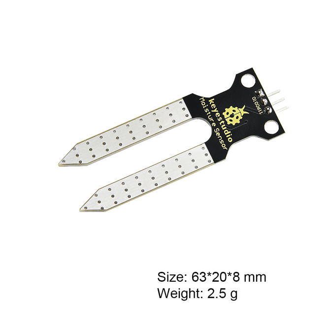
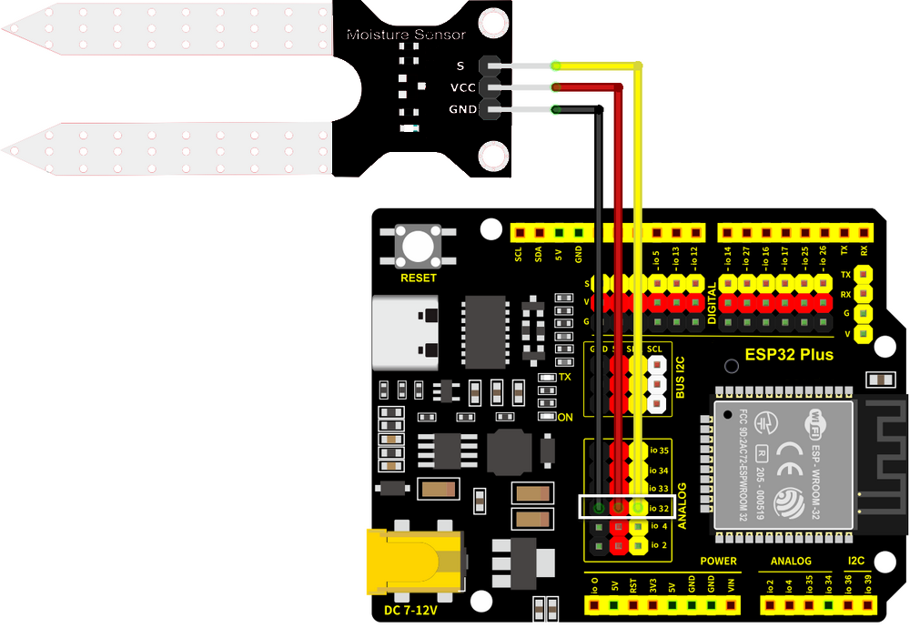

# Soil Moisture Probe

!!! abstract "At a glance"
    **Category:** Smart Agriculture — measures how wet the soil is
    **In your kit:** ×1
    **Time:** about 20 minutes

---

## What is it?

The Soil Moisture Probe is a two-pronged sensor that you push into soil. It measures how much water is between the prongs and reports that as an analog number to your ESP32. **Wetter soil → lower number. Drier soil → higher number.**

{ width="380" }

In the **Smart Agriculture** project, this is the sensor that decides *when to water*. Your code reads the moisture value, decides if the soil is too dry, and (if the water tank also has water) turns the pump on.

## How it works

The two prongs are electrodes — tiny exposed metal pads. When the soil between them is wet, water carries a small electrical current from one prong to the other. The drier the soil, the harder it is for current to flow.

The module measures this resistance and converts it to an **analog voltage** between 0 V and 3.3 V. The ESP32 reads this voltage as a number from **0 (saturated wet) to 4095 (bone dry)**.

!!! info "Why is the value scale so weird (0–4095)?"
    The ESP32 has a 12-bit analog-to-digital converter. "12 bits" means 2¹² = 4096 possible values, numbered 0 through 4095. Most analog sensors in your kit will produce readings in this range.

## Specifications

| Property | Value |
|----------|-------|
| Operating Voltage | 3.3 V – 5 V |
| Output type | Analog |
| Reading range | 0 (very wet) — 4095 (very dry) |
| Sensitive area | Just the bottom 2 cm of the prongs |

## Pin layout

| Soil Moisture pin | ESP32 Plus pin | Wire |
|-------------------|----------------|------|
| **S** (Signal) | **IO 32** | 🟡 Yellow |
| **V** (Voltage) | V on the same header | 🔴 Red |
| **G** (Ground) | G on the same header | ⚫ Black |

!!! warning "IO 32 is input-only"
    On the ESP32, pins 32, 34, 35, 36, and 39 can only be **read** from, never written to. That's perfect for a sensor — you only ever read it. Don't try to "set IO 32 to HIGH" later; it won't do anything.

## Wiring



**Step by step:**

1. Unplug the USB cable from your ESP32 Plus.
2. Plug one end of a 3-pin Dupont cable into the soil-moisture module (match S/V/G).
3. Plug the other end into the **IO 32** header on the ESP32 Plus shield (the *Analog IN* group).
4. Push the two prongs into the soil of a real plant pot, or for testing, a small cup of water.
5. Plug the USB cable back in.

!!! danger "Don't submerge the black breakout board"
    Only the **silver prongs** should touch the wet soil or water. If you submerge the small black board with the chip on it, water can short the circuitry and ruin the sensor. Push the prongs in vertically; keep the board above the soil line.

## Code

### Build the program

Drag these blocks into your workspace:


**Block-by-block:**

| Block | What it does |
|-------|--------------|
| `when Arduino begin` | Program starts |
| `serial 0 begin baudrate 115200` | Opens the Serial Monitor for debugging |
| `forever` | Repeats forever |
| `set var moisture to (read analog pin IO 32)` | Stores the moisture reading in a variable |
| `serial 0 print join "Moisture: " moisture` | Prints the reading |
| `wait 2 seconds` | Wait between readings |

### Upload and watch

1. Click **Upload** and wait about 30 seconds.
2. Open the **Serial Monitor** (bottom-right panel) and set the baud rate to 115200.
3. Watch the numbers scroll: a moisture reading every 2 seconds.

## Expected result

In the Serial Monitor:

```
Moisture: 4050   ← prongs in dry air, very high
Moisture: 4042
Moisture: 1850   ← prongs pushed into damp soil
Moisture: 1820
Moisture: 380    ← prongs dipped in a glass of water
```

!!! tip "Test it three ways"
    1. Hold the prongs in dry air → number near 4095
    2. Push into damp soil → number drops to 1500–2500
    3. Dip the prongs into water → number drops below 800

    Watching the readings change as you move the prongs is the fastest way to confirm the sensor is working.

## Try it!

!!! question "Challenge 1 · Find the dry threshold"
    What reading does *your* soil give when the plant clearly needs water? Push the prongs in and write down the number. That's *your* "dry" threshold for the agriculture project.

!!! question "Challenge 2 · Add a label"
    Print a friendlier message: instead of just `Moisture: 1850`, print `Moisture: 1850 — soil is damp` or `Moisture: 4040 — soil is dry`. Use an `if` block to choose the message based on the reading.

!!! question "Challenge 3 · Looking ahead"
    Combine this with the LED you built earlier: **IF moisture > 3000 → LED on (warning: too dry)**. That's the first half of the Smart Agriculture decision logic.

## What's next?

[Water Level Detector :material-arrow-right:](water-level.md){ .md-button .md-button--primary }
