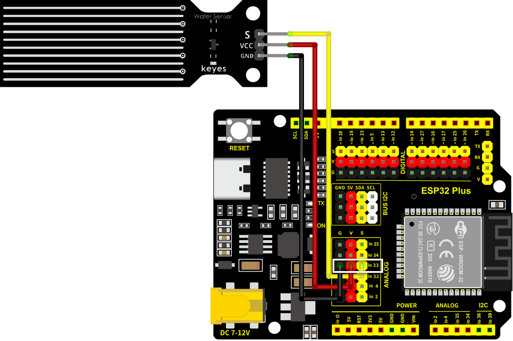

# Water Level Detector

!!! abstract "At a glance"
    **Category:** Smart Agriculture: measures depth of water in the tank
    **In your kit:** ×1
    **Time:** about 20 minutes

---

## What is it?

The Water Level Detector is a flat sensor with comb-shaped traces of exposed copper. When water touches the traces, it bridges them and changes the resistance; the more of the sensor that's submerged, the lower the resistance. Your ESP32 reads this as an analog number: **deeper water → higher reading.**

In the **Smart Agriculture** project, this sensor measures how much water is in the tank that feeds the pump. **Empty tank → don't run the pump (or it will burn out).** That's the safety check.

## How it works

The sensor has 10 horizontal copper lines, alternating between two sets: a "drive" set and a "sense" set. When water sits on the sensor, it creates a conductive path between the drive and sense sets. More water = more parallel paths = lower resistance = higher analog reading.

| Water level | Approximate reading |
|-------------|--------------------:|
| Sensor dry | 0 |
| Bottom of sensor in water | 600–800 |
| Half submerged | 1500–2000 |
| Fully submerged | 2500–3000 |

!!! info "It can't measure exact volume"
    This sensor is great for "is there enough water?" decisions but not for measuring exact litres. The reading depends on water purity, sensor age, and how clean the surface is.

## Specifications

| Property | Value |
|----------|-------|
| Operating Voltage | 3.3 V – 5 V |
| Output type | Analog |
| Reading range | 0 (dry) to ~3000 (fully submerged) |
| Detection length | About 40 mm |

## Pin layout

| Water Level pin | ESP32 Plus pin | Wire |
|-----------------|----------------|------|
| **S** (Signal) | **IO 33** | 🟡 Yellow |
| **V** (Voltage) | V on the same header | 🔴 Red |
| **G** (Ground) | G on the same header | ⚫ Black |

## Wiring



**Step by step:**

1. Unplug the USB cable from your ESP32 Plus.
2. Plug a 3-pin Dupont cable into the water-level module (match S/V/G).
3. Plug the other end into the **IO 33** header on the ESP32 Plus.
4. Stand the sensor vertically inside an empty container that you can pour water into.
5. Plug the USB cable back in.

!!! danger "Keep the connector dry"
    Only the **bottom comb-shaped section** should be in water. The pin header at the top must stay above the waterline. If water reaches the connector, the sensor short-circuits and gives garbage readings (and may damage itself).

## Code

### Build the program

Drag these blocks into your workspace:


**Block-by-block:**

| Block | What it does |
|-------|--------------|
| `when Arduino begin` | Program starts |
| `serial 0 begin baudrate 115200` | Opens the Serial Monitor |
| `forever` | Repeats forever |
| `set var level to (read analog pin IO 33)` | Stores the reading in a variable |
| `serial 0 print join "Water level: " level` | Prints the reading |
| `wait 2 seconds` | Wait between readings |

### Upload and watch

1. Click **Upload**.
2. Open the **Serial Monitor** (115200 baud).
3. Slowly pour water into the container until it reaches the bottom of the sensor. The reading jumps from 0 to a few hundred.
4. Pour more water and the reading climbs as the water rises.

## Expected result

```
Water level: 0       ← sensor dry
Water level: 0
Water level: 720     ← water just touches the bottom
Water level: 1880    ← water about half-way up
Water level: 2740    ← sensor fully submerged
```

!!! tip "Test progression"
    Don't just dump water in. **Pour slowly** and watch the reading climb. Confirming that the number changes smoothly is the best proof the sensor works correctly.

## Try it!

!!! question "Challenge 1 · Find your 'low water' threshold"
    For the agriculture project, you want to know when the tank is "almost empty." Fill the tank to *just below* the level where the pump can no longer suck water out. Note the reading; that's your low-water threshold.

!!! question "Challenge 2 · Combine with the LED"
    **IF water level < 500 → LED on (low water warning)**. This is exactly the second half of the Smart Agriculture project's logic: combining sensor + actuator.

!!! question "Challenge 3 · Both sensors at once"
    You now have two analog readings: soil moisture (IO 32) and water level (IO 33). Print both on the same line in the Serial Monitor: `Soil: 1850  |  Water: 720`. Multi-sensor monitoring is what real IoT systems do all day.

## What's next?

[Water Pump (with Relay) :material-arrow-right:](water-pump.md){ .md-button .md-button--primary }
