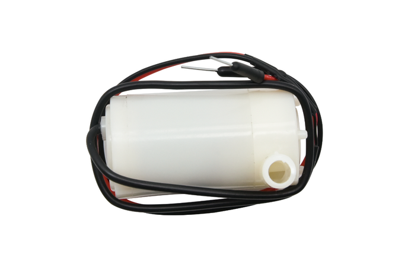
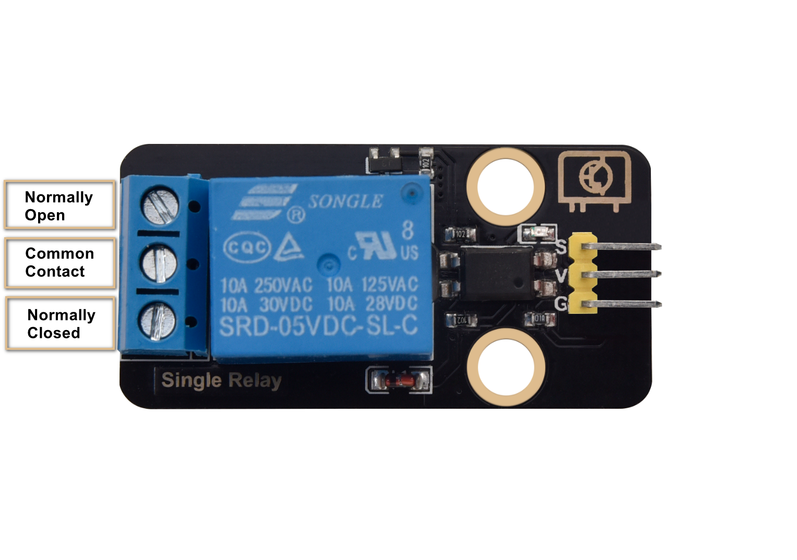
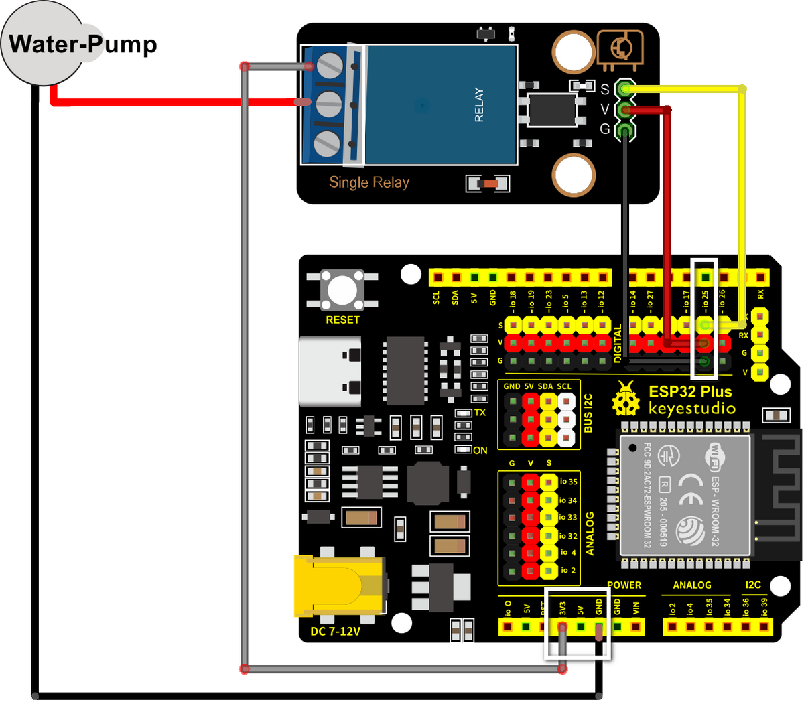

# Water Pump (with Relay)

!!! abstract "At a glance"
    **Category:** Smart Agriculture — moves water from the tank into the soil
    **In your kit:** 1 × Water Pump, 1 × Relay Module, 1 × length of Water Pipe, 1 × Plastic Box (reservoir)
    **Time:** about 30 minutes

---

## What is it?

The Water Pump is a small **submersible pump** — drop it into water, give it power, and it pushes water out through the pipe. Simple as that.

{ width="380" }

But there's a catch: the pump needs **more current than an ESP32 GPIO pin can supply**. Plugging it directly into your ESP32 would damage the board. So we control it through a **Relay Module** — an electrical switch that the ESP32 can flip on and off using a small signal, while the pump's own power supply provides the muscle.

{ width="380" }

In the **Smart Agriculture** project, the relay+pump combination is what *acts on* the decision your code makes: when the soil is dry and the tank has water, the ESP32 closes the relay → the pump runs → water flows.

## How it works

A relay is **a small electronic switch operated by an even smaller electronic signal**. Inside the relay there's an electromagnet (the coil) and a metal contact arm (the switch). When the ESP32 sends 3.3 V to the relay's S (Signal) pin, the coil energises, the magnetic field pulls the contact arm, and the switch closes — letting the pump's higher-voltage circuit complete and run.

When the ESP32 sends LOW, the coil de-energises, the contact springs back open, and the pump stops.

```
ESP32 Plus IO pin (small signal) ──► Relay coil
                                       │
                       ┌── Pump + battery ──┐
                       │                    │
                  Relay switch ── COM────►──┘
                       (closes when coil energised)
```

!!! info "Why bother with the relay?"
    Your ESP32 GPIO pins can deliver about **20 mA** at 3.3 V. The pump draws about **300 mA** at 5 V. Direct-driving would either fail to spin the motor (not enough current) or damage the GPIO pin (overcurrent). The relay isolates the two circuits — your ESP32 is the brain, the pump's power supply is the muscle.

## Specifications

### Water Pump

| Property | Value |
|----------|-------|
| Operating Voltage | 3 V – 6 V |
| Current draw | ~300 mA at 5 V |
| Pump rate | ~120 L/hour |
| Type | Submersible (must be in water to run) |

### Relay Module

| Property | Value |
|----------|-------|
| Coil voltage | 3.3 V – 5 V (controlled side) |
| Switch capacity | Up to 10 A at 250 V AC / 30 V DC (load side) |
| Pin Type | Digital Input (S = signal from ESP32) |

## Pin layout

| Relay pin | ESP32 Plus pin | Wire |
|-----------|----------------|------|
| **S** (Signal) | **IO 19** | 🟡 Yellow |
| **V** (Voltage) | V on the same header | 🔴 Red |
| **G** (Ground) | G on the same header | ⚫ Black |

The pump itself does **not** plug into the ESP32 — its two wires connect to the relay's screw-terminal block, with one of them in series with a battery or 5 V power supply.

## Wiring



**Step by step:**

1. Unplug the USB cable from your ESP32 Plus.
2. Plug a 3-pin Dupont cable from the **Relay's S/V/G** pins into the **IO 19** header on the ESP32 Plus.
3. The pump has two wires (red and black). Connect them through the relay's **screw terminal block**: one pump wire to *COM* (common), the other to *NO* (normally open). The supply wire from your battery or 5 V source goes to the other side of the same path.
4. Drop the pump into the water tank (the Plastic Box from your kit, half full of water).
5. Attach the Water Pipe to the pump's outlet.
6. Plug the USB cable back into the ESP32 Plus.

!!! danger "The pump must be SUBMERGED before running"
    This pump is **water-cooled** — it relies on the surrounding water to keep the motor from overheating. Running it dry, even for a minute, can permanently damage the motor. **Always check the pump is fully under water before pressing Upload.**

!!! warning "Don't run the pump for more than ~10 seconds in tests"
    For testing, short pulses (3–5 seconds on, then off) are plenty. You'll see whether water comes out the pipe, and you avoid emptying your tank in seconds.

## Code

### Build the program

Drag these blocks into your workspace:


**Block-by-block:**

| Block | What it does |
|-------|--------------|
| `when Arduino begin` | Program starts |
| `forever` | Repeats forever |
| `set digital pin IO 19 to HIGH` | Closes the relay → pump runs |
| `wait 3 seconds` | Pump runs for 3 seconds |
| `set digital pin IO 19 to LOW` | Opens the relay → pump stops |
| `wait 5 seconds` | Wait before pumping again |

### Upload and watch

1. Make sure the pump is **fully submerged**.
2. Make sure the Water Pipe is pointing somewhere safe (a sink or bucket).
3. Click **Upload**.
4. Watch the pump cycle: 3 seconds on, 5 seconds off, repeat. You should hear the motor and see water spurt from the pipe.

## Expected result

You hear a clicking sound from the relay every time it switches (that's the contact arm moving). Water comes out of the pipe in 3-second bursts.

## Try it!

!!! question "Challenge 1 · Quick burst"
    Change the pump-on time to **0.5 seconds**. The pump barely turns over and the water comes out in tiny squirts. This is closer to what real irrigation does — short, precise watering rather than long floods.

!!! question "Challenge 2 · Pump only on demand"
    Combine with the soil-moisture sensor: **IF moisture > 3000 → pump on for 3 seconds → check again**. That's the core decision loop of the Smart Agriculture system.

!!! question "Challenge 3 · The full safety logic"
    Add the water-level check: **IF moisture > 3000 AND water-level > 500 → pump on**. If the tank is empty (water-level low), don't run the pump even if the soil is dry — it would burn out. This is exactly the build you'll complete next.

## What's next?

[Build the Smart Agriculture System :material-arrow-right:](build.md){ .md-button .md-button--primary }
